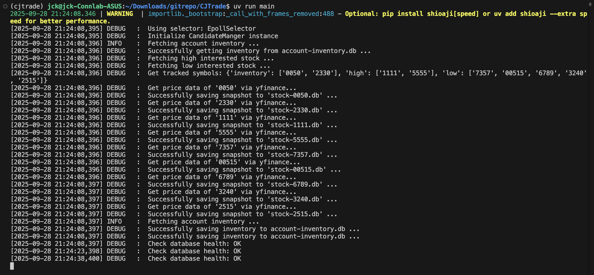

# CJ Trade



## Introduction

CJ Trade is a trading system for `TWSE`. It comes with multiple great, out-of-the-box features, including:
- AI-driven dicision
- Robust technical analysis
- Feedback-driven, dynamic strategy.

### :warning: Below is for developer in this project.

## Project Status

### FY25_W38_PROJ_W1 (9/22 - 9/28)

Current Project Status: Already stub most of the important modules (except for `analysis`). And will be more focus on modulizing task creation logic, aiming for:
1. Create user-defined phase (e.g. `POST_MARKET` phase is occurred every 2PM to 6PM, from Mon. to Fri.)
2. Create user-defined phase handler (e.g. When it's `POST_MARKET` phase, run user-defined sequence of tasks)

#### Stubbing Phase 1 (Only try to meet the main loop's needs)
- [x] Stub `news` module
- [x] Stub `database` module
- [x] Stub `llm` module (But haven't weave it into the logic)
- [ ] Stub `analysis` module **(depends on 3 queues, hence skip)**
- [x] Stub `stockdata` module
- [x] Stub `ui` module
- [x] Stub `account` module
- [x] Stub `candidate` module

### FY25_W39_PROJ_W2 (9/29 - 10/5)

#### Main Loop Correcting Phase 1
- [x] Finish `news` and `llm` first-stage abstraction
- [x] Consider to wrap them into an `AppContext` class **(Not going to apply)**
- [x] Locate the section of the loop where errors or inefficiencies occur **(Need to separate task creation logic)**
- [ ] Try to add the logic of `shioaji` real-time price data (separated from the `yfinance` snapshot)
- [ ] Think of how to compress the real-time data into day-candlestick after market close
- [ ] Align the true execution flow

### FY25_W40_PROJ_W3 (10/6 - 10/12)

#### Stubbing Phase 2
- [ ] Stub `price` / `signal` / `order` queue operations
- [ ] Stub `analysis` module
- [ ] Realize the `database` interaction (Inventory part)

### FY25_W41_PROJ_W4 (10/13 - 10/19)

#### Main Loop Correcting Phase 2
- [ ] Store `historical-win-ratio` for different technical rules for choosing the most suitable rule
- [ ] Add `TaskGroup` for user to create their specific handler
- [ ] Finish `PhaseScheduler` to able to call `pre` / `undergo` / `post` phase handler


## Information for Devs

### Background Worker

- `news` module for gathering market news and forum information.
- `llm` module for processing `news` information and pick interested candidate.
- `analysis` module for process technical analysis, containing commonly-use indicators.
- `stockdata` module for fetching remote data source (currently Yahoo Finance) and executing high performance CRUD operations on `sqlite3` database.
- `ui` module for drawing user interface for ease-of-use experience (including Web/CLI/GUI).
- `account` module for fetching account information and stock inventory.
- `candidate` module for storing candidate picked by `llm` module and `analysis` module. (level 0 pool has more candidates but less confidence, level 1 pool has less candidates but more confidence)

## Coding Style Guide
```python
# Module(File) and Package(Folder) name (lower case and apply abbreviation)
# If the source file is for abstraction (has nothing to do with this module's core logic)
# please give it a name started with single underscore
# for example, modules.stockdata.fetch_data is the core logic and it depends on two data source
# one from database (_database.py) and one from yahoo finance (_data_source_provider.py)
# when source code needs to use this module, only import those name not started with underscore
import matplotlib
import module.account as ac
from module.ui import gui  # cj data source provider

# Class Name (Big camel style)
CandidatePool

# Class Method (Big camel style)
cand = candidatePool.GetHighestConfidence()

# Class Internal Method (Big camel style started and ended with two underscore)
self.__Normalize__()

# Class Instance (Small camel style)
CandidatePool candidatePool

# Variable Name (lower case with underscore)
cand = cand_from_pool_level_1

# Internal Variable Name (started and ended with two underscore)
__cand__ = __cand_highest__
```

## Build
```
uv run main
```
