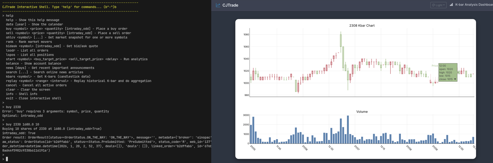

# CJ Trade



## Introduction

CJ Trade is a trading system for `TWSE`. It comes with multiple great, out-of-the-box features, including:
- AI-driven dicision
- Robust technical analysis
- Feedback-driven, dynamic strategy.

## Project TODO
Note that the todos listed here is for those brand new feature, those still don't have a specific file to put into, or those not sure where to put.
If it is a modification to existing logic, please mark todo directly in that file, and it will be easier to trace using todo tree extension.

- [ ] Add `get_latest_kbar() -> Kbar` or related feature that can fetch exact one kbar.
- [ ] Add abstraction to database interaction and think about what and how to record. (sqlite3 first)
- [ ] Add candidate manager related feature.
- [ ] Add `Dash` package and work with stateful UI (not only kbar chart but also some buttons and fields).

### Kbar aggregation interval consistency
- For mock securities, YFinance supports: 1m,2m,5m,15m,30m,60m,90m,1h,1d,5d,1wk,1mo,3mo
- For sinopac securities, Sinopac supports: N/A (Only 1m kbar)
- For unified `AccountClient` class requires: 1m,3m,5m,10m,15m,20m,30m,45m,1h,90m,2h,1d,1w,1M
Consider to align `AccountClient` requirements with yfinance so that there won't be any conversion needed.

## Run
```sh
git clone git@github.com:jackiesogi/cjtrade
cd cjtrade
uv sync
source .venv/bin/activate

# For sinopac user:
echo "API_KEY=${YOUR_SINOPAC_API_KEY}" >> .env
echo "SECRET_KEY=${YOUR_SINOPAC_SECRET_KEY}" >> .env
echo "CA_PATH=${YOUR_SINOPAC_CA_PATH}" >> .env
echo "CA_PASSWORD=${YOUR_SINOPAC_CA_PASSWORD}" >> .env

# For those who don't have a sinopac account but still want to try it out,
# try adding --broker=mock to use the mock environment (no login required):
python3 src/cjtrade/tests/cjtrade_shell.py --broker=mock # Will become main CLI tool in the future.

# For testing all the features in cjtrade shell
bash src/cjtrade/tests/test_cjtrade_shell_all_cmds.sh  # Test all CLI commands
```

### For clear, maintainable branch design
- `master`: Master branch.
- `broker/{brokername}`: Broker's API bridging, data handling, broker-specific features and tests.
- `test/{optinonal-name}`: Generic test script and integration test. (For testing broker's API stability -> `broker/{brokername}`)
- `ui/{ui-type}`: Rendering chart, web interface, etc.
- `misc/{misc-type}`: LLM / analytics features.