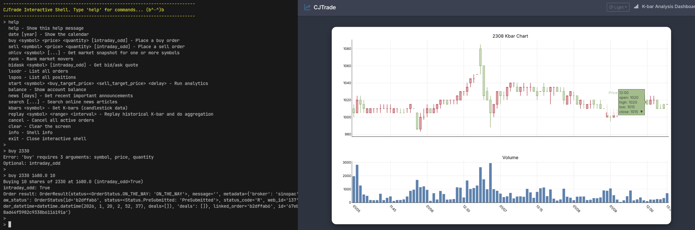
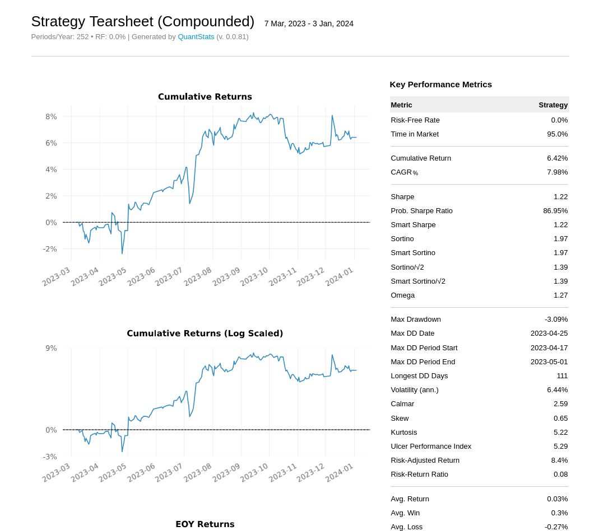

# CJ Trade



## Introduction

CJ Trade is a trading system development framework for `TWSE`.
You can write your trading strategy using the CJTrade API and integrate it with any supported securities broker (證券商).

It comes with two main components: `apps` and `pkgs`.

* `pkgs` provide useful APIs for:
  * Fetching financial news
  * Calculating technical indicators (技術指標)
  * Integrating with securities brokers
  * Asking LLMs for advice
  * Fetching financial statements (財務報表)
  * Drawing K-bars (K線圖)

* `apps` are example applications built using these `pkgs`.

### Available apps in [`apps`](https://github.com/jackiesogi/CJTrade/tree/master/src/cjtrade/apps)

>#### 1. CJTrade Interactive Shell

A demonstration shell that showcases most of the capabilities provided by the CJTrade APIs.

>#### 2. CJTrade System

A 24/7 service that monitors prices, calculates Bollinger Bands (布林通道), generates AI-driven financial advice and account summaries, and places orders automatically so you don't have to trade manually.

>#### 3. ArenaX

A complete simulated execution environment using real historical price data. It supports order submission, time progression, and order matching, making it suitable for researchers who need to perform backtesting (回測) in a sandbox environment.

<details>
<summary><b>Supported Brokers</b></summary>

<ul>
<li>
<b>Sinopac</b> (永豐金證券)<br>
Full implementation with real-time market data and trading support.
</li>

<li>
<b>ArenaX</b> (模擬環境)<br>
Paper trading (模擬交易) and backtesting (回測) environment for strategy testing.
</li>
</ul>

</details>

<details>
<summary><b>Coming Soon</b></summary>

<ul>
<li><b>Cathay</b> (國泰證券)</li>
<li><b>Yuanta</b> (元大證券)</li>
<li><b>Mega</b> (兆豐證券)</li>
<li><b>Interactive Brokers</b> (盈透證券)</li>
</ul>

</details>


## Run CJTrade Interactive Shell
The CJTrade interactive shell (`cjtrade_shell`), is built mainly for users to explore CJTrade API functionalities.
As for automatic smart trading system, refer to `cjtrade_system` on the next section ("Run CJTrade System").

To run interactive shell, please install `uv` on your os first.
[https://docs.astral.sh/uv/getting-started/installation/](https://docs.astral.sh/uv/getting-started/installation/)

```sh
git clone https://github.com/jackiesogi/CJTrade
cd CJTrade
uv python install 3.12
uv venv --python 3.12
uv sync

source .venv/bin/activate # For Linux / macOS
.\.venv\Scripts\activate  # For Windows

mkdir data
```

### Play around using ArenaX broker (Built-in simulation environment)

```sh
# For those who don't have a securities account but still want to try it out,
# try adding --broker=mock to use the mock environment (no login required):

# generate simulation environment config template (Linux)
bash scripts/gen_config.sh arenax

# generate simulation environment config template (Windows)
.\scripts\gen_config.bat arenax

# start the simulation backend ArenaX
uv run arenaxd > /dev/null 2>&1 &

# then, connect to ArenaX broker
uv run cjtrade --broker=arenax

# For testing all the features in cjtrade shell (Linux)
uv run atest  # stands for 'A'renax 'TEST'
```

### Sinopac users

```sh
# Get your required api keys from https://ai.sinotrade.com.tw/python/Main/index.aspx#pag4:
bash scripts/gen_config.sh sinopac # or .\scripts\gen_config.bat sinopac on Windows
echo "# -------- Overwritten part --------" >> sinopac_system.cjconf
echo "API_KEY=${YOUR_SINOPAC_API_KEY}" >> sinopac_system.cjconf
echo "SECRET_KEY=${YOUR_SINOPAC_SECRET_KEY}" >> sinopac_system.cjconf
echo "CA_CERT_PATH=${YOUR_SINOPAC_CA_PATH}" >> sinopac_system.cjconf
echo "CA_PASSWORD=${YOUR_SINOPAC_CA_PASSWORD}" >> sinopac_system.cjconf

# After configuring properly, you can connect to sinopac securities
uv run cjtrade --broker=sinopac

# For testing all the features in cjtrade shell
uv run test --broker=sinopac
```

## Run CJTrade System
CJTrade System is an automatic smart trading system, it continuously monitor your positions and stock price in real time,
uses Bollinger Bands (布林通道) strategy to automatically place order for you.

:warning: This feature is in the PoC stage and under active development. Expect rapid changes and potential instability.

If you want to test it out, please follow the installation guide in the previous section, and run:

```sh
# Note that choosing `sinopac` as broker will place real order when strategy condition is met,
# unless you expliclitly export an environment variable `export SIMULATION=y` before running this.
export CJSYS_WATCH_LIST=0050,2330,2357,2454,3443,3231  # your price watch list
uv run system --broker=arenax --mode=none
```

## Backtesting
We currently provide two ways for backtest your trading strategy: `oneshot` and `full_sim`.

- `full_sim`: It is basically CJTrade System (in the previous section), it will replay historical price data in high speed (e.g. 30,000x), and do real time price monitoring and analyzing.

- `oneshot`: It will also fetch historical data, and test your strategy by doing bar-by-bar analysis (逐根K線分析) at once, and will typically generate the result in seconds.

For testing oneshot:
:warning: there is an existing bug here, normally it would failed to fetch kbar data. We'll fix this in next minor version
```sh
# Root cause:
# `cjtrade_oneshot_backtest.py` directly calls `ArenaX_MiddleWare` rather than `ArenaXBrokerAPI_v2`,
# get_kbars() from ArenaXBrokerAPI_v2 will auto try yfinance data provider as fallback when real_broker's
# data not available at that time range, or simply because user does not set up a real account (e.g. --mode=none)
# However, get_kbars() from ArenaX_MiddleWare, user need to explicitly pass `fallback=True` in order to
# have fallback mechanism, currently poc/backtest.sh does not pass this parameter.
bash poc/backtest.sh \
  --watch-list 2317,2357,2454,2890,3443 \
  --fund 5000000 \
  --start 2024-12-16 \
  --days 60 \
  --interval 1d \
  --mode none
```
After the backtest is finish, it will generate a insightful report for evaluating your strategy. (CAGR, Sharpe ratio, Win rate...)

:warning: Note that the strategies under testing are currently still hardcoded inside the code, we will separate the user-code (strategy) and engine in the future.



## Test
1. Run basic tests: all command in cjtrade shell
```sh
uv run test --broker=sinopac --group=all
```

2. Run full tests: test hotpaths (normal input / edge cases / stress tests)
```sh
bash tests/run_broker_stability_tests.sh --broker=arenax
```

3. Run full unit test
```sh
uv run pytest tests/unit
```

## Start develop your trading strategy using CJTrade API

:warning: The API is not stable now!

See [API refernce](https://github.com/jackiesogi/CJTrade/tree/master/doc)
