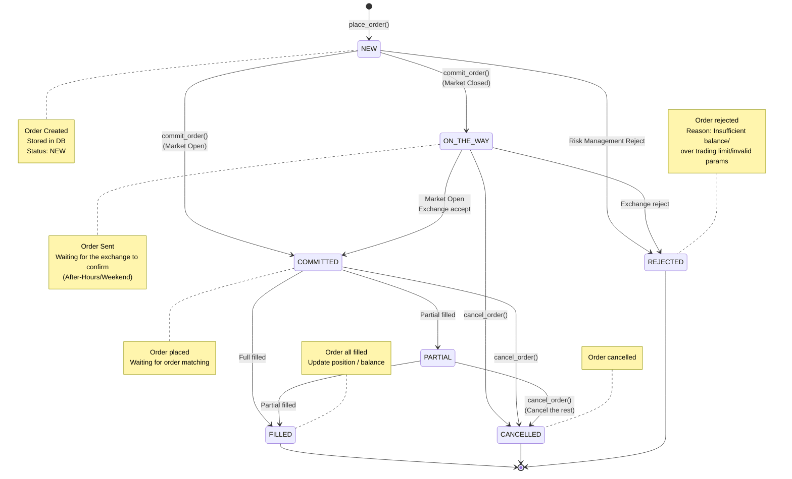

```mermaid
stateDiagram-v2
    [*] --> NEW: place_order()
    
    note right of NEW
        Order Created
        Stored in DB
        Status: NEW
    end note
    
    NEW --> ON_THE_WAY: commit_order()<br/>(Market Closed)
    NEW --> COMMITTED: commit_order()<br/>(Market Open)
    NEW --> REJECTED: Risk Management Reject
    
    note right of ON_THE_WAY
        Order Sent
        Waiting for the exchange to confirm
        (After-Hours/Weekend)
    end note
    
    ON_THE_WAY --> COMMITTED: Market Open<br/>Exchange accept
    ON_THE_WAY --> REJECTED: Exchange reject
    ON_THE_WAY --> CANCELLED: cancel_order()
    
    note right of COMMITTED
        Order placed
        Waiting for order matching
    end note
    
    COMMITTED --> PARTIAL: Partial filled
    COMMITTED --> FILLED: Full filled
    COMMITTED --> CANCELLED: cancel_order()
    
    PARTIAL --> FILLED: Partial filled
    PARTIAL --> CANCELLED: cancel_order()<br/>(Cancel the rest)
    
    FILLED --> [*]
    CANCELLED --> [*]
    REJECTED --> [*]
    
    note left of FILLED
        Order all filled
        Update position / balance
    end note
    
    note left of CANCELLED
        Order cancelled
    end note
    
    note left of REJECTED
        Order rejected
        Reason: Insufficient balance/
        over trading limit/invalid params
    end note
```