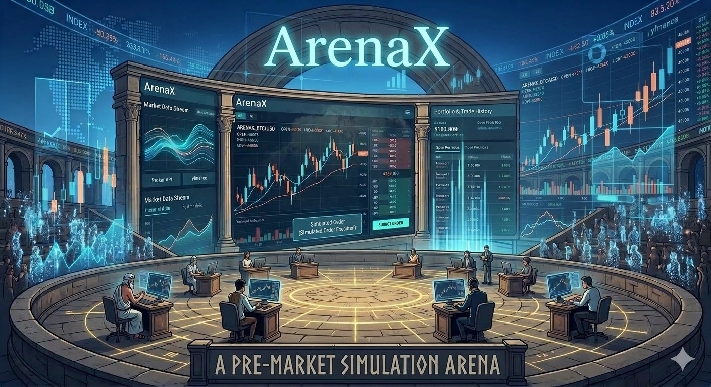

# ArenaX (試煉場 券商模擬器)

## Introduction

ArenaX is a simulated broker designed for CJTrade.
It provides a fully functional trading environment that mimics the behavior of a real broker, allowing client applications to interact with it as if they were connected to a live trading service.

ArenaX supports:

- **Market data streaming**
Price data can be obtained from either a custom broker API or yfinance.

- **Price data playback**
The progression of time in the virtual market can be controlled by the user, enabling accelerated or slowed-down playback for testing purposes.

- **Order submission and matching**
Orders submitted by the client are processed by ArenaX, which simulates order execution based on the incoming market data.

- **Portfolio management**
Users can create accounts and track positions, balances, and trade history within the simulated environment.

These capabilities allow developers and traders to test trading strategies and client applications without connecting to a real broker or risking real capital.

## Modes

>:memo: Most of the **data** in this doc refers to **price data**.

There are 3 modes in ArenaX, they are categorized by their "price data source" and "use case".

| Mode   | Price Data Source | Typical Use Case                                          |
| ------ | ----------------- | --------------------------------------------------------- |
| `live` | Custom broker API | Paper trading with real-time market data                  |
| `hist` | Custom broker API | Historical market replay for backtesting                  |
| `none` (default) | `yfinance`        | Lightweight simulation **WITHOUT** needing a broker account |
