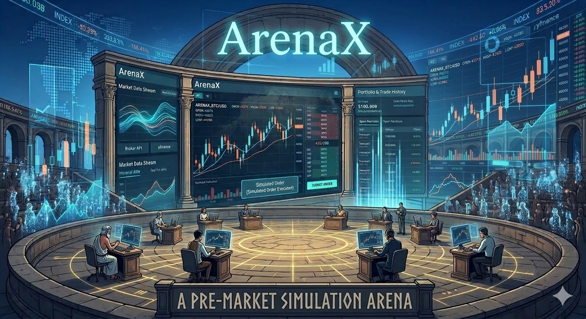
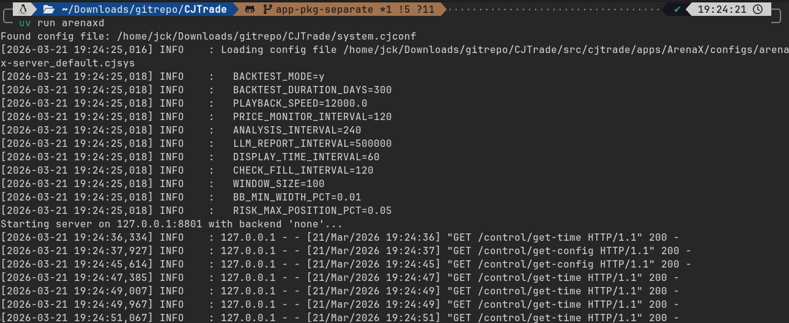
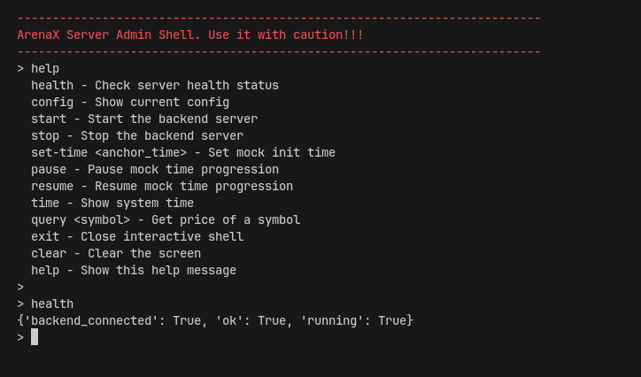
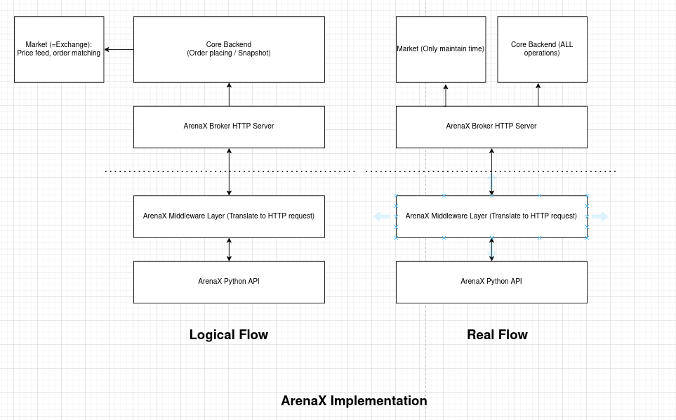

# ArenaX (試煉場 券商模擬器)



## Introduction

ArenaX is a simulated broker written for CJTrade.
It is a complete trading environment that behaves the way a real broker does, so
a client application cannot tell it apart from a paper trading service — the
same `AccountClient` code talks to both.

ArenaX provides:

- **Market data**
  Prices come from any `MarketData` source (Sinopac, FinMind, yfinance, or one
  you write), and are cached locally so a repeated run does not refetch them.

- **Price data playback**
  Time in the virtual market is under your control. You set where the timeline
  begins, how fast it advances, and you can pause it or step it yourself.

- **Order submission and matching**
  Orders are matched against the incoming market data, with commission, 證交稅
  and slippage applied, and with each order's time-in-force (ROD / IOC / FOK /
  GTC) deciding when it expires.

- **Portfolio management**
  Accounts, positions, balance and trade history are all tracked inside the
  simulation, and a run can be resumed from a saved account snapshot.

Together this lets you test strategies and client applications without
connecting to a real broker or risking real money.

## Modes

> :memo: Most of the **data** in this doc refers to **price data**.

There are 3 modes in ArenaX, categorised by their price data source and use
case. Each one ships its own `configs/<mode>.cjsys` and listens on its own port,
so two modes can run side by side without fighting over one.

| Mode | Default price sources | Default port | Typical Use Case |
| ---- | --------------------- | ------------ | ---------------- |
| `demo` (default) | `yfinance` | 8801 | Lightweight simulation **WITHOUT** needing a broker account |
| `backtest` | `sinopac,yfinance` | 8802 | Historical market replay for backtesting |
| `paper` | `sinopac` | 8803 | Paper trading with real-time market data |

<!-- cjcheck: static -->
```sh
uv run arenaxd --backend=backtest        # or demo / paper / real
```

`--data` (or `AX_DATA_SOURCES`) chooses the price sources, tried in order:
`sinopac`, `finmind`, `yfinance`, `cache`, `offline`. Sinopac is logged in to only when a
source or the backend needs it, so a backtest can run with no broker account:

<!-- cjcheck: static -->
```sh
uv run arenaxd --backend=backtest --data=finmind,yfinance
```

FinMind reads `FINMIND_TOKEN` from your `.cjconf` and serves daily bars on a
free account; a 1m replay still needs a source of 1m bars for its window
(yfinance keeps only the last 30 days). From Python, pass any `MarketData` as
`ArenaX_BrokerSideServer(market_data=...)`.

Every source sits behind a price cache file. `--price-db` (or
`AX_PRICE_DB_PATH`) chooses the file; the default is the shared cache in the
platform cache directory. To run with no network at all, preload a file and
start with `--data=offline`, which serves only what the file holds:

<!-- cjcheck: static -->
```sh
uv run preload-prices --price-db exp.db --symbols 2330,2317 --start 2026-10-26
CJTRADE_OFFLINE=1 uv run arenaxd --backend=demo --data=offline --price-db=exp.db
```

`GET /api/v1/market/<symbol>/kbars` returns only bars that have closed on the
simulated clock. `start` and `end` take whole dates (`end` inclusive) or ISO
datetimes (a half-open window).

:warning: `arenaxd` reads `AX_*` environment variables before its config file,
and `load_dotenv(override=False)` means whatever is already exported wins. A
stale `AX_HOST_PORT` from an earlier session will therefore silently keep the
backtest backend on the demo port. `unset AX_HOST_PORT AX_HOST_ADDRESS
AX_STATE_FILE` before switching modes.

Starting the server and starting the simulated backend are two steps. The
process comes up first and then logs in and preloads price data, which takes
somewhere between a few seconds and a minute depending on the window. Until
that finishes, `/health` answers `"running": false` — poll it rather than
guessing with `sleep`.

## Test with the server admin shell

### Start the server first!

<!-- cjcheck: static -->
```sh
uv run arenaxd
```



### Then open the admin shell

<!-- cjcheck: static -->
```sh
uv run aresh  # stands for "ARE"nax "SH"ell
```



## RESTful API

Everything below assumes the default demo port. Change `8801` to match your
mode.

### Server and backend

1. Check health — also the readiness probe:
<!-- cjcheck: static -->
```sh
curl http://127.0.0.1:8801/health
```

2. Start the simulated backend:
<!-- cjcheck: static -->
```sh
curl -X PUT -H "Content-Type: application/json" \
  -d '{"running": true}' http://127.0.0.1:8801/api/v1/backend
```

3. Stop it again (the server process stays up):
<!-- cjcheck: static -->
```sh
curl -X PUT -H "Content-Type: application/json" \
  -d '{"running": false}' http://127.0.0.1:8801/api/v1/backend
```

4. Read the configuration the server and the backend are actually running with:
<!-- cjcheck: static -->
```sh
curl http://127.0.0.1:8801/api/v1/config
```

> `server_config` is the broker-side server's own config — listening address and
> port. `backend_config` is the core logic it runs: playback speed, backtest
> duration, cost model.

### Clock

5. Read the current market time:
<!-- cjcheck: static -->
```sh
curl http://127.0.0.1:8801/api/v1/clock
```

6. Set where the timeline BEGINS. This is not "jump to this moment": it snaps to
09:00, and unless told otherwise it also starts the clock and refetches the data
cache.
<!-- cjcheck: static -->
```sh
curl -X PUT -H "Content-Type: application/json" \
  -d '{"mock_init_time": "2026-03-20T00:00:00"}' \
  http://127.0.0.1:8801/api/v1/clock/origin
```

7. List the bar timestamps a replay will step through. This is how a replay
driver (the trading engine's `ReplayClock`) finds its timeline: the kbars
route only returns bars the clock has already reached, while this returns
timestamps for the whole window, with no prices.

<!-- cjcheck: static -->
```sh
curl "http://127.0.0.1:8801/api/v1/clock/timeline?symbols=2330,2317&start=2026-03-02&end=2026-03-07"
```

### Trading

A client opens a session first (`POST /api/v1/session`), and then uses:

| Route | Purpose |
| ----- | ------- |
| `GET /api/v1/account` | Balance and positions |
| `GET /api/v1/account/fills` | Fill history, filterable by session |
| `GET /api/v1/orders` | Everything resting or resolved |
| `POST /api/v1/orders` | Place one order |
| `GET /api/v1/orders/<id>` | One order's status |
| `DELETE /api/v1/orders/<id>` | Cancel it |
| `GET /api/v1/market/<symbol>/snapshot` | A quote: price, bid/ask, the day's range so far |
| `GET /api/v1/market/<symbol>/kbars` | Closed K-bars over a date range, up to the simulated clock |
| `GET /api/v1/market/data-availability` | Which symbols and windows are actually on disk |

The full interactive spec is served by the process itself — open
`http://127.0.0.1:8801/docs` while it is running.

### Useful test scripts

1. Watch how fast time progresses inside the ArenaX virtual environment:
<!-- cjcheck: static -->
```sh
watch -n 3 -d --color "curl -s http://127.0.0.1:8801/api/v1/clock | jq ."
```

2. Print the backend and server config as it changes:
<!-- cjcheck: static -->
```sh
watch -n 3 -d --color "curl -s http://127.0.0.1:8801/api/v1/config | jq ."
```

## Development

### Current architecture

