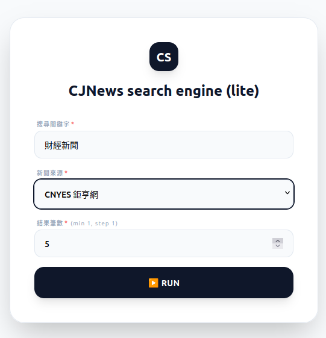

# CJNews

A financial news search engine built using CJTrade SDK.

Only 72 lines of code are used.

## Package used
- `cjtrade.pkgs.ui`: For quick rendering web-based form using toml DSL.
- `cjtrade.pkgs.analytics`: For bridging different news sources.

## Demo

- Search engine interface

- Search result

