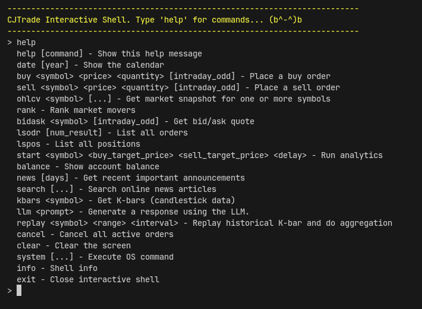
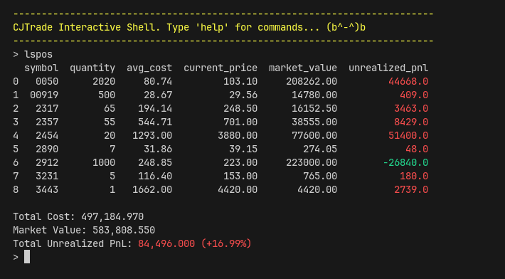
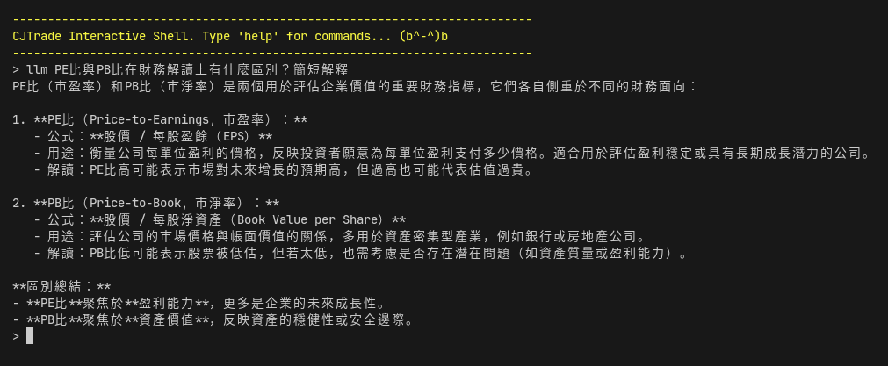
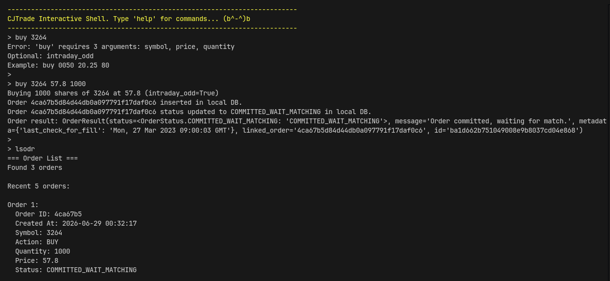

# CJTrade Shell

>An interactive shell for trading.

Currently there are 21 commands for you to...
- Manipulate your bank account.
- Place `BUY` / `SELL` order.
- Search recent news.
- Interact with LLM for financial advice.

and more!

## Package used
Basically everything provided from CJTrade SDK, because this app was initially built for API functional testing.

## Demo

Below are some demo images:

- List position (`lspos`)

    

- Ask LLM (`llm`)

    

    Note that `llm` has context-awareness of your account state (cash balance, positions, trade history...), so actually you can ask for advice

- Place order(`buy`), List order(`lsodr`)

    
