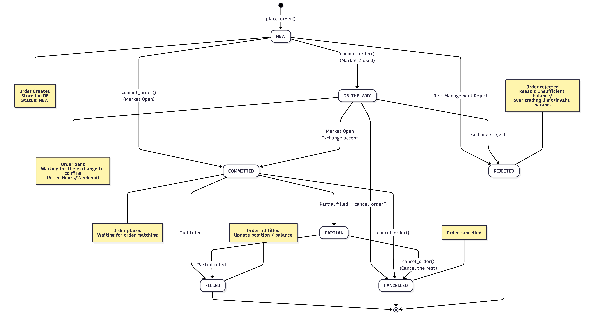

# Broker Implementation Guide

> Order state graph


## Overview

The `cjtrade` project provides a unified programming interface for developers to design trading strategies that work across different securities brokers (證券商). This abstraction layer (抽象層) bridges our CJTrade API to different brokers' backends, which allows user to write their own apps (e.g. trading strategies, account balance alerts ...) and deploy it across multiple broker platforms.

## Supported Brokers

### Currently Available
- **Sinopac** (永豐金證券) - Full implementation with real-time data and trading
- **Mock** (模擬環境) - Paper trading (模擬交易) environment for strategy testing

### Coming Soon
- **Cathay** (國泰證券)
- **Yuanta** (元大證券)
- **Mega** (兆豐證券)
- **Interactive Brokers** (盈透證券)

## Architecture

### Core Abstraction

Each broker implementation is a directory containing a standalone broker interface. All brokers inherit from the `BrokerAPIBase` base class, which defines the required methods for:

- **Account Management**: Check balance, account status
- **Market Data**: Real-time quotes, historical data, five-level order book
- **Position Management**: List positions, calculate P&L
- **Order Management**: Place, modify, cancel orders
- **Historical Data**: K-bar data for backtesting and analysis

### Interface Contract

The `BrokerAPIBase` class in `broker_base.py` defines the contract that all broker implementations must follow:

```python
class BrokerAPIBase:
    def connect(self) -> bool
    def get_balance(self) -> dict
    def get_bid_ask(self, product: Product) -> dict
    def get_positions(self) -> List[Position]
    def place_order(self, order: Order) -> dict
    def get_kbars(self, product: Product, ...) -> List[KbarData]
    # ... and more
```

## Contributing a New Broker

### Prerequisites

- Understanding of OOP (物件導向程式設計)
- Access to the broker's API documentation
- API credentials for testing (sandbox/demo accounts preferred)

### Step 1: Understand project structure

Create a new directory for your broker implementation:

```bash
cd src/cjtrade/brokers/
mkdir your_broker_name
cd your_broker_name
```

Create the following files:
```bash
touch __init__.py          # Python package initialization
touch your_broker.py       # Main broker implementation
touch _internal_func.py    # Helper functions (if needed)
```

### Step 2: Implement the Interface

Create your broker class inheriting from `BrokerAPIBase`:

```python
# your_broker.py
class YourBroker(BrokerAPIBase):
    def __init__(self, **config: Any):
        super().__init__(**config)
        self.api_key = config.get('api_key')

    def connect(self) -> bool:
        # The real logic to connect to "YourBroker server"
        do_something_1()

    def get_balance(self) -> Dict:
        # The real logic to retrieve account balance
        do_something_2()

    def place_order(self, order: Order) -> Dict:
        do_something_3()

    # Implement all other required methods...
```

### Step 3: Handle Data Conversion

Most broker APIs return data in their own format. You'll need to convert this to our standard models. (Note that CJTrade standard models exists in `models/` directory.)

```python
def _convert_to_position(self, broker_position_data) -> Position:
    """Convert broker-specific position data to our Position model"""
    return Position(
        symbol=broker_position_data['symbol'],
        quantity=broker_position_data['qty'],
        avg_price=broker_position_data['avg_cost'],
        # ... map other fields
    )
```

You can refer to how `sinopac/` handle data conversion. You will find that all the data conversion functions (that are not related to core logic) are separated out of `sinopac.py` and are put into `_internal_func.py` for clarity.


### Step 4: Register with AccountClient

**Why this step is crucial:** The `AccountClient` class serves as the central dispatch system that abstracts broker selection from end users. Instead of users having to manually instantiate different broker classes, they simply specify a broker type, and the `AccountClient` handles the creation and configuration automatically.

#### The Dispatch Pattern

The `AccountClient` implements a **factory pattern** that:
1. **Unified Interface**: Provides a single entry point for all broker operations
2. **Type-Safe Dispatch**: Uses `BrokerType` enum to ensure type safety
3. **Lazy Loading**: Only imports and instantiates the requested broker
4. **Configuration Management**: Handles broker-specific configuration consistently

#### Implementation Steps

1. **Add your broker type** to the `BrokerType` enum in `src/cjtrade/models/`:

```python
class BrokerType(Enum):
    SINOPAC = "sinopac"
    MOCK = "mock"
    YOUR_BROKER = "your_broker"  # Add this line
```

2. **Update the dispatch logic** in `src/cjtrade/core/account_client.py`:

```python
def _create_broker(self, broker_type: BrokerType, **config) -> BrokerAPIBase:
    """
    Factory method to create broker instances based on type.
    This dispatch system allows users to switch brokers without
    changing their strategy code.
    """
    if broker_type == BrokerType.SINOPAC:
        from cjtrade.brokers.sinopac.sinopac import SinopacBrokerAPI
        return SinopacBrokerAPI(**config)
    elif broker_type == BrokerType.MOCK:
        from cjtrade.brokers.mock.mock_broker import MockBrokerAPI
        return MockBrokerAPI(**config)
    elif broker_type == BrokerType.YOUR_BROKER:
        from cjtrade.brokers.your_broker.your_broker import YourBroker
        return YourBroker(**config)
    else:
        raise ValueError(f"Unsupported broker type: {broker_type}")
```

## Best Practices
Check existing implementations (`sinopac/` and `mock/`) for reference.

## Maintenance

### Version Compatibility
Ensure your broker implementation remains compatible with:
- The broker's API changes
- CJTrade framework updates
- Python version requirements