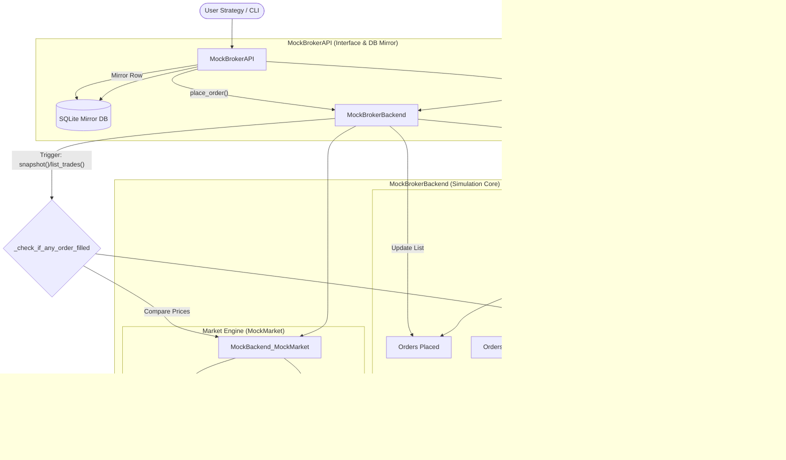

```mermaid
graph TD
    %% Entry Layer
    User([User Strategy / CLI]) --> API[MockBrokerAPI]

    subgraph "MockBrokerAPI (Interface & DB Mirror)"
        API --> DB[(SQLite Mirror DB)]
        API --> Backend[MockBrokerBackend]
    end

    subgraph "MockBrokerBackend (Simulation Core)"
        Backend --> State[MockBackend_AccountState]
        Backend --> Market[MockBackend_MockMarket]

        subgraph "Internal State (AccountState)"
            State --> P_List[Orders Placed]
            State --> C_List[Orders Committed]
            State --> F_List[Orders Filled]
            State --> X_List[Orders Cancelled]
            State --> Pos[Positions & Balance]
        end

        subgraph "Market Engine (MockMarket)"
            Market --> Time[Time Simulation: Playback Speed / Market Hours]
            Market --> History[(Historical Data: yfinance / Real Broker)]
        end
    end

    %% Flow: Order Placement
    API -- "place_order()" --> Backend
    Backend -- "Update List" --> P_List
    API -- "Mirror Row" --> DB

    %% Flow: Filling Logic
    Backend -- "Trigger: snapshot()/list_trades()" --> CheckFill{_check_if_any_order_filled}
    CheckFill -- "Compare Prices" --> Market
    CheckFill -- "Match" --> F_List
    F_List -- "Update" --> Pos
```